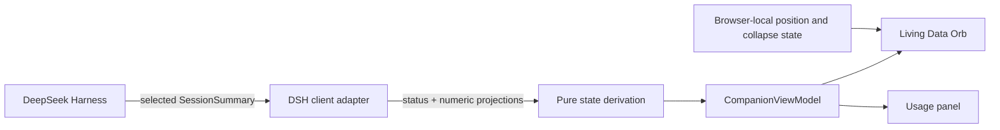

# DSH Companion

English | [简体中文](./README.md)

A lightweight Agent Companion for DeepSeek Harness Web. It turns the selected session's activity, context pressure, and optional usage metrics into a glanceable Living Data Orb.

> Status first, usage on demand; friendly without becoming distracting.


This image is a visual-regression baseline rendered from production components and synthetic states. It covers no session, idle, working, waiting, context attention, context warning, and the completion response.

## The idea in one minute

DSH Companion communicates two independent signals:

1. **Activity** — whether the agent is sleeping, idle, working, or waiting for you.
2. **Context pressure** — how much of the model context window the next request is projected to occupy.

Context, billed input, output, cache hit, and step metrics appear only when you hover, focus, or pin the detail panel.

| Visual layer | Question answered | Presentation |
| --- | --- | --- |
| Expression and status label | What is the agent doing? | Sleeping, Idle, Working, Waiting, Done |
| Pressure ring and text label | Does context need attention? | Normal, Attention, Warning, Unknown |
| Usage panel | What resources has this session used? | Only metrics already available from DSH |

## Design principles

### Status first, usage on demand

Activity and context pressure are the default experience. Detailed numbers stay secondary until the user asks for them.

### Ambient, not demanding

The companion can communicate work, required interaction, and completion without flashing, covering the page, or demanding continuous reading. It can be moved or collapsed into a recoverable edge tab.

### Friendly, not gamified

The Living Data Orb uses expression and restrained motion to improve comprehension. The MVP deliberately avoids feeding, leveling, rewards, collections, cosmetics, and multi-pet mechanics.

### Honest about data

Missing projections remain unknown or absent. The companion never fabricates zero usage, pricing, balances, or streaming estimates.

### Native to DSH

The plugin mounts additively in `shell.overlay`, follows the selected session, consumes existing projections, and respects the host lifecycle, semantic styling, and accessibility patterns.

### Observational and privacy-first

The companion does not modify prompts, tools, model requests, or session events. It does not inspect conversation content, reasoning, tool input/output, files, credentials, or provider accounts, and it has no telemetry or remote service.

## Architecture at a glance



DSH owns the event log and projection folds. Companion starts at the selected summary already exposed to the Web client; it does not scan the log, poll a backend, or duplicate upstream accounting.

Detailed design documents:

- [Product Design](./docs/product/product-design.md)
- [Visual Design](./docs/product/visual-design.md)
- [Architecture](./docs/architecture.md)
- [MVP User Stories](./docs/product/2026-08-16-mvp-user-stories.md)

## State model

### Activity

| State | Meaning |
| --- | --- |
| Sleeping | No session is selected |
| Idle | The selected session is ready and not running |
| Working | The agent is executing |
| Waiting | The session needs an answer, approval, or another user interaction |
| Celebration / Done | A brief response after the same session moves from Working to Idle |

Waiting takes priority over working because required user action is the more important signal.

### Context pressure

| Band | Projected occupancy | Meaning |
| --- | ---: | --- |
| Unknown | Cannot be derived reliably | Required projection data is absent or invalid |
| Normal | `< 70%` | No action suggested |
| Attention | `70% – < 85%` | Context is growing and worth noticing |
| Warning | `≥ 85%` | Consider finishing, compacting, or starting a fresh session |

Pressure uses visible text, ring weight, and color together, so color is never the only signal.

## Interaction

- **Hover or keyboard focus** previews usage.
- **Click** pins or unpins the panel.
- **Escape or an outside click** closes a pinned panel.
- **Drag** moves the companion and saves its browser-local position.
- **Collapse** replaces the orb with a reachable edge tab.
- **Restore** returns the orb to its saved position.

The surrounding overlay is click-through. Only the orb, panel, and recovery tab receive pointer input.

## Metrics

| Metric | Definition |
| --- | --- |
| Context | Projected token use divided by the model context window |
| Billed input | Uncached input + cache reads + cache writes |
| Output | The accumulated provider-reported output-token count |
| Cache hit | Cache-read tokens divided by billed input, rounded to a whole percentage |
| Steps | Completed session steps |

Unavailable metrics are omitted instead of estimated.

## Install

Install from npm into the DSH Web profile:

```sh
dsh plugin --profile web add dsh-companion
dsh web
```

You can also build a local tarball from source:

```sh
git clone https://github.com/gjnzsu/dsh-companion.git
cd dsh-companion
pnpm install --frozen-lockfile
pnpm build
pnpm pack --pack-destination .
dsh plugin --profile web add ./dsh-companion-0.1.1.tgz
dsh web
```

Remove it with:

```sh
dsh plugin --profile web remove dsh-companion
```

## Privacy

The companion reads only status and numeric projections already delivered for the selected session, plus browser-local placement preferences. It has no telemetry, remote service, cloud synchronization, conversation-content inspection, tool-output inspection, credential access, or provider-account access.

## Compatibility

`dsh-companion@0.1.1` targets **DeepSeek Harness `0.1.0-rc.5`** exactly. Harness is in developer preview, so later release candidates may require a Companion update.

## Development and testing

Development requires Node.js `^22.19.0 || >=24.0.0` and pnpm `11.15.1`.

```sh
pnpm install --frozen-lockfile
pnpm test
pnpm typecheck
pnpm build
pnpm gallery
pnpm test:visual
pnpm pack:check
```

Run the keyless real-Web smoke against a Harness source checkout from PowerShell:

```powershell
$env:DSH_REPO='C:\SourceCode\deepseek-harness'
pnpm test:smoke
```

The test strategy has two layers:

- **Synthetic state tests** cover state combinations, pressure boundaries, themes, compact viewports, reduced motion, and interactions.
- **Real Web smoke** proves that the packed plugin installs into DSH and follows the actual selected session.

## MVP limitations

Version `0.1.0` supports DSH Web and the selected session only. It does not provide streaming estimates, pricing or cost calculations, history, growth mechanics, multiple companions, prompt/tool-content analysis, or cloud synchronization.

## License

[MIT](./LICENSE)
