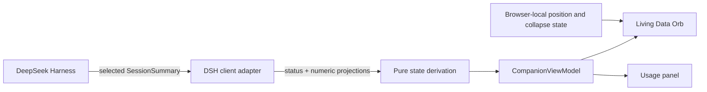

# DSH Companion

[English](./README.en.md) | 简体中文

一个运行在 DeepSeek Harness Web 中的轻量 Agent Companion。它把当前会话的活动状态、上下文压力和用量信息，变成一个可以快速扫一眼就理解的 Living Data Orb。

> 状态优先，用量按需；友好，但不打扰。


上图是由生产组件和合成状态生成的视觉回归基线，覆盖无会话、空闲、工作、等待、上下文提醒、上下文警告和任务完成反馈。

## 一分钟了解它

DSH Companion 同时表达两个互相独立的信号：

1. **活动状态**：Agent 正在休眠、空闲、工作，还是等待你响应。
2. **上下文压力**：预计下一次请求会占用多少模型上下文窗口。

点击或悬停宠物后，才会进一步显示 Context、Billed input、Output、Cache hit 和 Steps。这样日常工作时只需要看状态，需要诊断时才查看数字。

| 视觉层 | 回答的问题 | 表现方式 |
| --- | --- | --- |
| 表情与状态标签 | Agent 正在做什么？ | Sleeping、Idle、Working、Waiting、Done |
| 压力环与文字标签 | 上下文是否需要关注？ | Normal、Attention、Warning、Unknown |
| 用量面板 | 当前会话用了多少资源？ | 只展示 DSH 已提供的可用指标 |

## 设计理念

### 状态优先，用量按需

默认界面只传达活动状态和上下文压力。详细数字不会持续占据注意力，只有在悬停、键盘聚焦或点击固定面板时出现。

### 安静陪伴，而非打扰

宠物可以表达工作、等待和完成，但不会闪烁、拦截整个页面或要求持续阅读。用户可以拖动它，也可以折叠成屏幕边缘的恢复标签。

### 友好，但不游戏化

Living Data Orb 使用表情和轻量动效帮助理解状态；MVP 不包含喂养、升级、奖励、皮肤、留存任务或多宠物系统。

### 对数据保持诚实

缺少 projection 时，指标会保持 Unknown 或直接省略。插件不会把未知数据显示为 `0`，也不会估算价格、余额或流式 token。

### 原生融入 DSH

插件通过 `shell.overlay` 以附加方式挂载，跟随当前选中的 session，读取 DSH 已有 projections，并遵循宿主的生命周期、语义样式和无障碍模式。

### 观察型、隐私优先

插件不会修改 prompt、tool、模型请求或 session event。它不读取对话内容、推理内容、工具输入输出、文件、凭证或供应商账户，也没有遥测和远程服务。

## 工作原理



DSH 负责维护事件日志和 projections。Companion 从 Web 客户端已经提供的当前 session summary 开始工作，不扫描事件日志，不轮询后端，也不重新实现上游统计逻辑。

更详细的设计资料：

- [产品设计](./docs/product/product-design.md)
- [视觉设计](./docs/product/visual-design.md)
- [架构设计](./docs/architecture.md)
- [MVP 用户故事](./docs/product/2026-08-16-mvp-user-stories.md)

## 状态说明

### 活动状态

| 状态 | 含义 |
| --- | --- |
| Sleeping | 当前还没有选中的 session |
| Idle | 当前 session 已准备好，没有正在执行 |
| Working | Agent 正在执行任务 |
| Waiting | Agent 正在等待问题、审批或其他用户交互 |
| Celebration / Done | 同一个 session 从 Working 进入 Idle 后的短暂完成反馈 |

`Waiting` 的优先级高于 `Working`，因为需要用户响应通常是更重要的信息。

### 上下文压力

| 等级 | 预计占用率 | 含义 |
| --- | ---: | --- |
| Unknown | 无法可靠计算 | projection 缺失或数据无效 |
| Normal | `< 70%` | 暂时不需要处理 |
| Attention | `70% – < 85%` | 上下文正在增长，值得留意 |
| Warning | `≥ 85%` | 可以考虑完成任务、压缩上下文或创建新 session |

压力等级同时使用文字、环形粗细和颜色表达，不依赖颜色作为唯一提示。

## 交互方式

- **悬停或键盘聚焦**：临时查看用量。
- **点击宠物**：固定或取消固定用量面板。
- **Escape 或点击外部**：关闭已固定面板。
- **拖动**：移动宠物；位置会保存在当前浏览器中。
- **折叠**：缩成最接近屏幕边缘的 `Show DSH Companion` 标签。
- **恢复**：点击边缘标签回到保存位置。

外层 overlay 是 click-through 的，只有宠物、面板和恢复标签接收指针输入。

## 用量指标

| 指标 | 定义 |
| --- | --- |
| Context | 预计 token 数除以模型 context window |
| Billed input | uncached input + cache read + cache write |
| Output | 供应商已报告并累计的 output token 数 |
| Cache hit | cache read ÷ billed input，四舍五入为整数百分比 |
| Steps | 已完成的 session steps |

不可用的指标会被省略，而不是被估算。

## 安装

当前 `0.1.0` 尚未发布到 npm。可以从源码构建 tarball 后安装到 DSH Web profile：

```sh
git clone https://github.com/gjnzsu/dsh-companion.git
cd dsh-companion
pnpm install --frozen-lockfile
pnpm build
pnpm pack --pack-destination .
dsh plugin --profile web add ./dsh-companion-0.1.0.tgz
dsh web
```

卸载：

```sh
dsh plugin --profile web remove dsh-companion
```

## 隐私

插件只读取当前 session 已经交付到 Web 客户端的状态和数字 projections：

- session id、running 和 pending interaction 状态；
- token usage、context pressure 和 steps；
- 浏览器本地保存的位置与折叠状态。

插件不会读取或发送：

- prompt、消息、推理过程、工具参数或工具结果；
- 文件内容、工作区数据、API key 或供应商账户；
- 价格、余额或账单信息；
- 遥测、分析事件或云同步数据。

## 兼容性

`dsh-companion@0.1.0` 精确面向 **DeepSeek Harness `0.1.0-rc.5`**。Harness 仍处于 developer preview，后续 release candidate 可能需要 Companion 更新。

## 开发与测试

需要 Node.js `^22.19.0 || >=24.0.0` 和 pnpm `11.15.1`。

```sh
pnpm install --frozen-lockfile
pnpm test
pnpm typecheck
pnpm build
pnpm gallery
pnpm test:visual
pnpm pack:check
```

针对 Harness 源码运行无 API Key 的真实 Web smoke：

```powershell
$env:DSH_REPO='C:\SourceCode\deepseek-harness'
pnpm test:smoke
```

测试体系分为两层：

- **合成状态测试**负责覆盖状态、压力边界、视觉主题、窄屏、reduced motion 和交互组合。
- **真实 Web smoke**负责证明打包后的插件能安装进 DSH，并跟随真实选中 session 更新。

## MVP 限制

`0.1.0` 只支持 DSH Web 和当前选中的 session。它暂不提供流式 token 估算、价格或成本、历史趋势、成长系统、多宠物、prompt/tool 内容分析或云同步。

## License

[MIT](./LICENSE)
