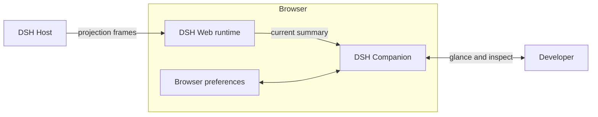
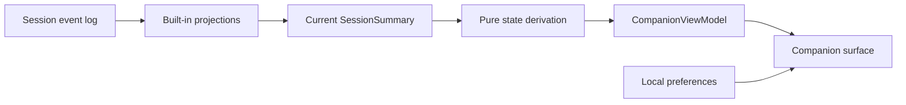
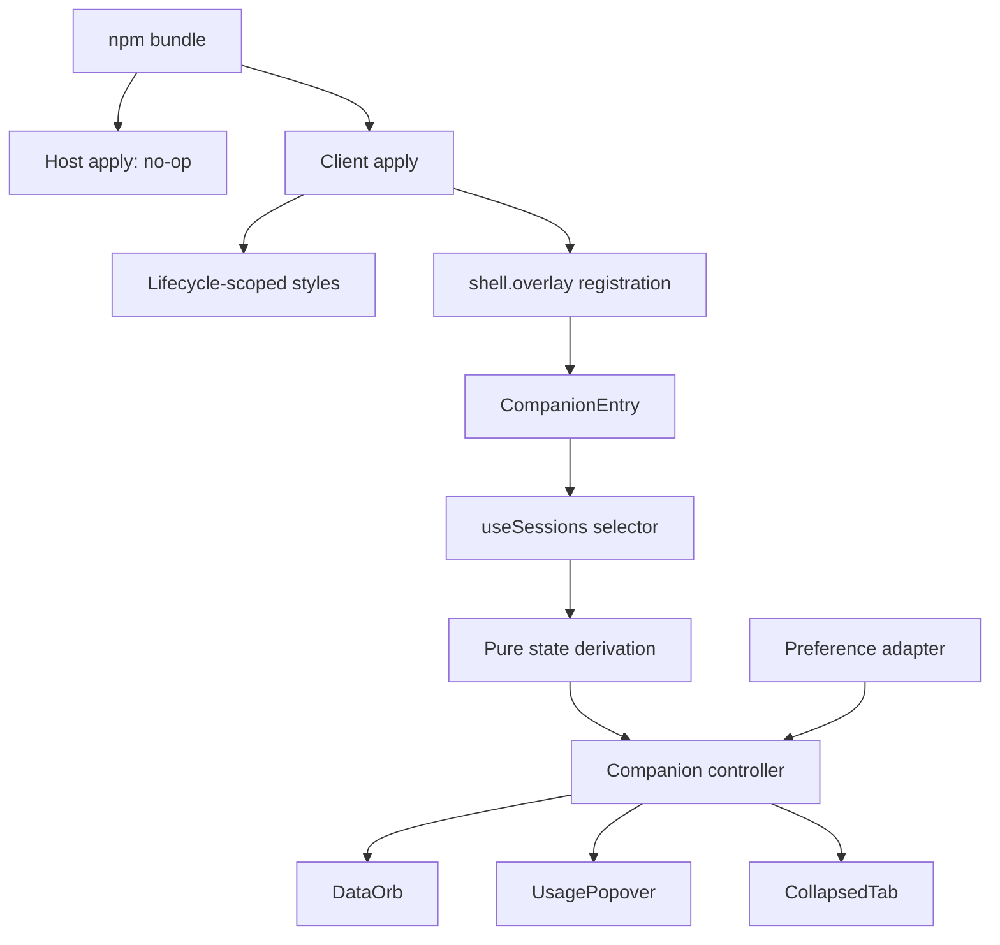
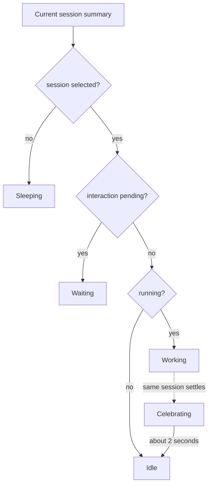
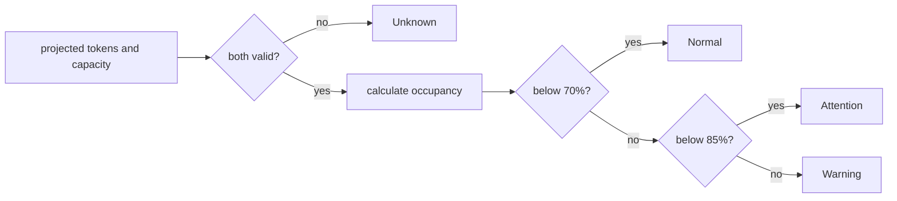

# DSH Companion Architecture

**Status:** Approved for MVP implementation
**Compatibility target:** DeepSeek Harness `0.1.0-rc.5`
**Runtime:** DSH Web browser client

## Architecture Summary

DSH Companion is a projection-native, browser-only plugin. The installed npm bundle contributes an empty host plugin so it participates in normal DSH profile composition, while all product behavior runs in the Web client.

The client registers one root-scoped component in `shell.overlay`. That component reads the currently selected `SessionSummary` through the framework-supplied `useSessions` hook, converts a small set of status and projection fields into a pure `CompanionViewModel`, and renders the orb and optional usage panel.

The plugin does not create a host service, scan the session log, poll, inspect conversation content, or send data to a remote service.

## System Context

The main reading path is left to right: DSH computes session facts, DSH Web exposes the selected summary, and the companion turns those facts into a user-visible signal.



DSH Companion has no direct provider, billing, credential, or telemetry connection. Browser preferences contain only placement and collapsed state.

## Runtime Boundaries

| Boundary | DSH Companion responsibility | Explicitly outside the boundary |
| --- | --- | --- |
| Host plugin | Export a no-op `apply()` so the bundle row mounts normally | Services, routes, projections, events, persistence |
| Client registration | Register styles and one `shell.overlay` entry through the Cordis lifecycle | Replacing the shell, conversation, or sidebar |
| Session input | Select the current summary and three existing projection values | Event-log scanning, full conversation data |
| Product derivation | Convert structural numeric/status input into a view model | Provider-specific accounting, price calculation |
| Presentation | Render state, metrics, motion, and interaction | Model-visible behavior or durable session mutation |
| Browser preference | Store clamped position and collapsed state | Cloud sync, accounts, session metadata |

## Primary Data Flow

The durable event log and projection folds are owned by DeepSeek Harness. The companion starts only at the client summary; it never reimplements the upstream fold.



The main flow is one-way. Presentation actions change only local interaction state or local preferences; they do not flow back into the session.

## Data Inputs

The selector reads only the current session and these existing fields:

| Source | Fields used | Purpose |
| --- | --- | --- |
| `SessionListState` | `current`, `byId` | Resolve the selected summary |
| `SessionSummary` | `id`, `running`, `pendingInteraction` | Activity |
| `tokenUsage` | `uncachedInputTokens`, `outputTokens`, `cacheReadTokens`, `cacheWriteTokens` | Billed input, output, cache hit |
| `contextPressure` | `projectedTokens`, `contextWindow` | Context occupancy and pressure band |
| `sessionStats` | `steps` | Completed step count |

Other summary and projection keys are ignored. The selector uses field equality so unrelated session-list updates do not force a new companion input.

## Derived Model

```ts
interface CompanionViewModel {
  activity: 'sleeping' | 'idle' | 'working' | 'waiting'
  pressure: 'unknown' | 'normal' | 'attention' | 'warning'
  contextPercent?: number
  contextTokens?: number
  contextWindow?: number
  billedInputTokens?: number
  outputTokens?: number
  cacheHitPercent?: number
  steps?: number
}
```

The view model contains only plain data. Components do not reinterpret session semantics.

### Activity Rules

1. No selected session produces sleeping.
2. A selected session with `pendingInteraction` produces waiting.
3. Otherwise `running: true` produces working.
4. All other selected sessions produce idle.

Waiting is checked before running.

### Pressure Rules

1. Both `projectedTokens` and a positive `contextWindow` must be finite and nonnegative.
2. Occupancy is `projectedTokens / contextWindow × 100`.
3. Below 70 is normal, 70 to below 85 is attention, and 85 or above is warning.
4. Invalid or absent input produces unknown.
5. The raw model percentage may exceed 100; presentation caps only the displayed value.

### Usage Rules

- Billed input is the sum of uncached input, cache reads, and cache writes.
- Cache hit is cache reads divided by billed input and rounded to an integer.
- Cache hit is absent when billed input is zero.
- An optional metric is absent when its authoritative projection data is absent or invalid.

## Component Architecture

The component diagram follows plugin load at the top, data adaptation in the middle, and user-visible surfaces at the bottom.



### Responsibilities

| Unit | Responsibility |
| --- | --- |
| `src/index.ts` | Empty host entry |
| `src/client/index.ts` | DSH type integration, selected-session adapter, style effect, overlay registration |
| `derive-state.ts` | Pure product rules and numeric guards |
| `preferences.ts` | Storage validation, defaults, persistence, viewport clamping |
| `Companion.tsx` | Hover/focus/pin, transition response, dragging, collapse, listeners, timer cleanup |
| `DataOrb.tsx` | Accessible activity and pressure presentation |
| `UsagePopover.tsx` | Available-only usage rows and formatting |
| `companion.css` | DSH-token-based appearance, state styling, motion, reduced motion |

There is no DSH-declared companion store in the MVP. One root overlay entry owns its transient presentation state locally; the only state that must survive remounts is stored in the validated browser preference record.

## State Model

### Activity Lifecycle



A session-id change clears pinned and celebration state before applying the new session's derived activity. Initial idle mount does not celebrate.

### Pressure Classification

Pressure is orthogonal to the activity lifecycle.



## Interaction and Local State

| State | Owner | Lifetime |
| --- | --- | --- |
| Current session summary | DSH runtime | Framework-managed |
| Derived view model | Pure render derivation | Current snapshot |
| Hover/focus | Companion component | Current interaction |
| Pinned popover | Companion component | Current page; cleared on session switch |
| Celebration | Companion component timer | Up to two seconds; cleared on switch/unmount |
| Drag gesture | Companion component | Pointer gesture |
| Position | Browser preference adapter | Browser profile |
| Collapsed state | Browser preference adapter | Browser profile |

The component installs document listeners only while they are needed and removes them during effect cleanup. Pointer capture keeps drag ownership stable. Resize handling reclamps the persisted position.

## Plugin Lifecycle

The client exports `inject = ['slots']` and registers through:

```ts
ctx.slots.inject('shell.overlay', () => ctx.slots.register({
  name: 'shell.overlay',
  id: 'dsh-companion',
  order: 100,
  label: 'DSH Companion',
}, CompanionEntry))
```

`slots.inject` waits for the layout-owned slot declaration, removes the contribution if the declaration collapses, and re-registers it after redeclaration. Style ownership is lifecycle-scoped and reference-counted so overlapping client fibers do not remove a style still in use.

## Packaging Architecture

The one npm package is both an installable DSH bundle and the plugin module named by its patch.

```text
dsh-companion package
├── package.json          dsh.bundle + dsh.client manifests
├── cordis.patch.yml      inserts the dsh-companion row
├── lib/index.js          no-op host entry
├── lib/client.js         DSH client module-loader artifact
├── lib/types/            declarations
├── README.md
└── LICENSE
```

The client artifact is a closure factory loaded through `window.__ModuleLoader__`. React and `react/jsx-runtime` resolve from the DSH Web platform module table. The package build must not import the Harness repository's internal `clientBundle` preset.

## Failure and Degradation

| Condition | Behavior |
| --- | --- |
| Session list still loading | Sleeping until a current summary exists |
| Projection hydration delayed | Activity renders; pressure or metrics remain unknown |
| Provider omits usage | Missing rows are omitted |
| Context capacity invalid | Pressure is unknown |
| Stored JSON malformed | Use safe default preferences |
| Storage read/write throws | Continue with in-memory state |
| Viewport becomes smaller | Clamp orb or tab to a reachable position |
| Client plugin unloads | Dispose registration, styles, listeners, and timers |

Normal partial data does not produce repeated warnings or error logs.

## Privacy and Security

### Data Read

- Current session id.
- Running and pending-interaction status.
- Numeric token, context, and step projections.

### Data Stored

- `x` and `y` viewport position.
- Collapsed state and recovery edge.

### Data Not Read or Sent

- Prompts, messages, reasoning, tool arguments, or tool results.
- File contents, workspace data, credentials, provider accounts, or balances.
- Pricing or billing data.
- Telemetry, analytics, or remote synchronization.

The plugin creates no network client and no host endpoint.

## Compatibility

The MVP targets the DSH `0.1.0-rc.5` client API:

- `shell.overlay` exists as a root-scoped list slot.
- Global slot components receive `useSessions`.
- `SessionSummary` exposes `running`, `pendingInteraction`, and `projectionValues`.
- `tokenUsage`, `contextPressure`, and `sessionStats` use the fields documented above.

Harness is in developer preview. A later release candidate may require a plugin update; compatibility is verified through type checking, built-artifact checks, and one packed-plugin smoke in official DSH Web fixture mode.

## Test Seams

| Seam | Evidence |
| --- | --- |
| Product derivation | Table-driven unit tests, including exact pressure boundaries |
| Preference adapter | Storage and viewport tests |
| Presentation | Synthetic component tests and accessibility queries |
| Interaction controller | Fake-timer and pointer/keyboard tests |
| Visual behavior | Shared gallery and deterministic Playwright screenshots |
| Slot lifecycle | Focused client registration/disposal test |
| Package contract | Build import and `pnpm pack` inspection |
| Real integration | Packed plugin in DSH Web `?fixture` mode |

Synthetic tests own behavioral breadth. The real smoke owns only the external DSH integration seam so failures remain easy to diagnose.

## Architectural Decisions

| Decision | Choice | Reason |
| --- | --- | --- |
| Data source | Existing session projections | Durable, current, no duplicated fold |
| Runtime | Client only | Product changes presentation, not agent behavior |
| Composition | `shell.overlay` | Global, additive, click-through surface |
| State derivation | Pure function | Testable and independent from React |
| Transient state | Local component state | One root entry; no shared business state |
| Durable UI preference | Local storage adapter | Browser-local, small, recoverable |
| Visual workbench | Lightweight gallery | Real components and synthetic scenarios without Storybook overhead |
| Integration proof | One real DSH fixture smoke | Detect slot/projection drift without duplicating component tests |

Create a separate Architecture Decision Record only when one of these decisions changes or a new irreversible dependency is introduced.

## Related Documents

- [Product Design](./product/product-design.md)
- [Visual Design](./product/visual-design.md)
- [MVP User Stories](./product/2026-08-16-mvp-user-stories.md)
- [Approved Design Record](./superpowers/specs/2026-08-15-dsh-companion-design.md)
- [Implementation Plan](./superpowers/plans/2026-08-16-dsh-companion-implementation.md)
