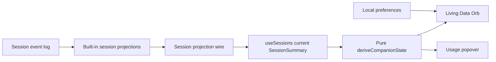

# DSH Companion Design

## Summary

DSH Companion is a browser-only DeepSeek Harness plugin that turns the current session's activity and context pressure into an ambient, friendly data orb. Its primary purpose is to let a developer understand whether the agent is working, waiting, idle, or approaching its context limit without repeatedly reading status bars or opening diagnostic panels.

The first release is intentionally narrow. It follows the currently selected DSH Web session, reads existing client-side session projections, and adds no host service, session event, model input, telemetry, or pricing logic.

## Product Goal

The MVP succeeds when a developer can understand agent activity and context pressure at a glance while using DSH Web. Detailed token metrics remain available on demand, but they do not dominate the interface.

The product is called **DSH Companion**. The repository and unscoped npm package are both named `dsh-companion`. The initial release is `0.1.0` under the MIT license.

## Target User and Job

The target user is a developer running agent tasks in DSH Web who switches attention between the agent and other work. When the developer returns to the page or glances at it, they want to know whether the agent is progressing, needs input, or is consuming a large share of the context window, so they can decide whether to keep waiting, intervene, or begin a fresh session.

## Experience Design

### Visual Character

The companion is an original **Living Data Orb** with a clearly recognizable friendly face. It should feel warm and alive without resembling an animal, branded character, or existing coding assistant mascot. Its form, color, expression, pulse, and small particles communicate state. Motion supports meaning and remains restrained enough for continuous display.

The orb lives in the global overlay rather than inside an individual page or panel. Only the visible orb and its popover receive pointer input; the surrounding overlay remains click-through.

### Activity States

The companion has four durable activity states and one transient response:

| State | Meaning | Presentation |
| --- | --- | --- |
| `sleeping` | No current session is available | Dimmed orb, closed or resting eyes, no active particles |
| `idle` | The current session is ready and not executing | Calm face and slow breathing motion |
| `working` | The agent is executing a turn or tool step | Focused expression, purposeful pulse, and active particles |
| `waiting` | The session requires user interaction or approval | Attentive expression with an amber prompt cue |
| celebration | A `working` session has just returned to `idle` | A brief, approximately two-second positive flourish before returning to idle |

Activity is derived from the current session summary. Waiting takes precedence over working when both signals are present because required user action is the more useful status. Celebration is local presentation state triggered only by a `working` to `idle` transition; it is not persisted or written to the session log.

Changing the selected session immediately clears transition state from the previous session.

### Context Pressure

Context pressure is an independent modifier layered over the activity state:

| Pressure | Context occupancy | Presentation |
| --- | ---: | --- |
| `unknown` | Projection absent or insufficient data | Neutral blue treatment; no numeric value |
| `normal` | Less than 70% | Normal activity-state treatment |
| `attention` | 70% through 84% | Noticeable warm accent without alarm styling |
| `warning` | 85% or more | Strong warning treatment that remains readable and non-flashing |

The percentage is computed from projected context tokens divided by the context window when both are valid. Presentation caps the displayed percentage at 100%, while the raw derived value may remain above 100% for diagnostics and tests. Missing data is never represented as zero.

The 70% and 85% thresholds are fixed product constants in the MVP. They are not deployment tunables because they define the companion's shared visual vocabulary rather than infrastructure behavior.

### Usage Details

Hovering or focusing the orb opens a compact usage popover. Clicking the orb pins or unpins the popover. Escape and clicking outside close a pinned popover. Pointer exit closes an unpinned popover after ordinary hover intent, without introducing a long delay.

The popover prioritizes information in this order:

1. Context occupancy and projected tokens versus context window.
2. Billed input and output tokens.
3. Cache hit percentage when it can be calculated meaningfully.
4. Session steps.

Unavailable metrics are omitted instead of displayed as zero or as misleading placeholders. The panel contains no pricing estimate in the MVP.

### Position, Visibility, and Accessibility

The orb can be dragged within the browser viewport. Its position and collapsed state are stored locally for that browser profile. Hiding collapses the orb into a small, labeled tab attached to the nearest viewport edge; activating that tab restores the orb. The tab cannot itself be hidden, so recovery never depends on a separate command or remembered shortcut. Pin state lasts only for the current page lifetime and is cleared when the selected session changes.

The orb uses native button semantics, exposes an accessible name that includes activity and pressure when known, supports keyboard focus and activation, and does not rely on color alone. Escape closes the popover. Reduced-motion preference removes particle travel, celebration bursts, and nonessential pulsing while preserving state through expression, color, and labels.

If browser storage is unavailable, the plugin continues with in-memory preferences for the current page.

## Technical Architecture

### Integration Strategy

The plugin is a projection-native, client-only DSH Web plugin. It does not introduce a polling endpoint, host-side token accounting service, provider-specific parser, or duplicated event-log scan.

The npm package contains an empty host loader so it can participate in ordinary DSH plugin installation. Its client entry injects one root-scoped component into `shell.overlay`, the existing global slot intended for floating application-wide surfaces. The component owns transient presentation state locally; validated browser preferences retain only position and collapsed state.



This approach makes the built-in projections the source of truth and keeps the companion observational. Installing the plugin cannot change prompts, tool calls, provider requests, token usage, or durable session data.

### Data Inputs

The companion reads the current entry exposed by the client session store and consumes existing projection values from its `SessionSummary`. Expected inputs are:

- `tokenUsage`: uncached input, output, cache-read, and cache-write tokens.
- `contextPressure`: pressure or projected tokens and context-window capacity.
- `sessionStats`: turns, steps, model timing, and tool timing where available.
- Current session execution and interaction state already exposed to DSH Web.

The implementation must tolerate an absent current session, delayed projection hydration, providers that do not report all usage fields, and new projection fields added by future Harness versions.

### Derived View Model

All product decisions are centralized in a pure derivation function. Rendering components do not infer session semantics independently.

```ts
interface CompanionViewModel {
  activity: 'sleeping' | 'idle' | 'working' | 'waiting'
  pressure: 'unknown' | 'normal' | 'attention' | 'warning'
  contextPercent?: number
  contextTokens?: number
  contextWindow?: number
  billedInputTokens?: number
  outputTokens?: number
  cacheHitPercent?: number
  steps?: number
}
```

Token values are exposed only when supplied by the relevant projection. Billed input is the sum of the projection's disjoint uncached-input, cache-read, and cache-write buckets. Cache hit percentage is cache-read tokens divided by billed input, rounded to an integer, and is exposed only when billed input is positive. Invalid numeric values are treated as unavailable at this external projection-to-view-model boundary.

### Proposed Repository Layout

```text
dsh-companion/
  package.json
  cordis.patch.yml
  tsconfig.json
  tsdown.config.ts
  README.md
  src/
    index.ts
    client/
      index.ts
      Companion.tsx
      DataOrb.tsx
      UsagePopover.tsx
      derive-state.ts
      preferences.ts
      companion.module.css
  tests/
    derive-state.test.ts
    companion.test.tsx
    lifecycle.test.ts
    gallery/
      index.html
      gallery.tsx
      scenarios.ts
    visual/
      companion.visual.spec.ts
    smoke/
      dsh-web.smoke.spec.ts
```

The exact test runner support files may be grouped differently during implementation, but responsibilities remain separated as shown.

### Component Responsibilities

- `src/index.ts` exports the no-op host `apply` function required by a browser-only plugin.
- `src/client/index.ts` registers lifecycle-scoped state and injects the companion into `shell.overlay`; every registration returns through the DSH/Cordis effect lifecycle.
- `Companion.tsx` selects the current session, derives the view model, coordinates transient celebration, popover state, dragging, and preferences.
- `DataOrb.tsx` is a presentational accessible button driven only by the view model and interaction props.
- `UsagePopover.tsx` renders only available metrics and owns no session derivation.
- `derive-state.ts` contains state priority, thresholds, percentages, and metric availability rules as pure functions.
- `preferences.ts` validates and clamps locally stored position and collapsed-state data and falls back to memory if storage access fails.

### Lifecycle and Session Switching

The overlay registration is root-scoped so one companion exists for the application. Subscriptions and listeners are installed through the plugin lifecycle and disposed when the client plugin is unloaded. Session selection remains reactive through `useSessions`; the companion never caches one session as a second source of truth.

Transient UI timers are cleared on unmount, plugin disposal, and session change. Drag coordinates are clamped after viewport resize so the orb cannot become permanently unreachable.

## Failure and Compatibility Behavior

Missing sessions and projections are expected startup states, not errors. The companion sleeps or presents unknown pressure until authoritative data arrives. It must not log repeated warnings for normal partial data.

Malformed local preferences are discarded. Storage read or write failure degrades to current-page memory. Rendering remains available if optional token or statistics projections are missing.

The initial compatibility target is the DSH `0.1.0-rc.5` client plugin API, including `shell.overlay` and the current `SessionSummary` projections. Because Harness is in developer preview, the README must name this target and state that later release candidates may require a plugin update. A thin integration contract test is retained specifically to detect projection or slot drift.

## Privacy and Security

The plugin has no telemetry, remote service, cloud synchronization, prompt inspection, tool-output inspection, credential access, or provider-account access. It observes numeric and status projections already delivered to the active DSH Web client. Local preferences contain only position and collapsed-state settings.

## Test Strategy

### Pure Derivation Tests

Table-driven unit tests cover every activity priority, pressure threshold edge, optional metric, invalid denominator, over-100% context result, and missing projection state. These tests provide the highest-confidence coverage for the product rules without requiring a running Harness instance.

### Synthetic State Matrix

A shared typed scenario catalog feeds component tests and the visual gallery. It contains at least:

| Scenario | Expected result |
| --- | --- |
| No session | Sleeping, pressure unknown, no fabricated metrics |
| Idle with unknown usage | Idle, neutral pressure, usage rows omitted |
| Working at 42% | Working with normal pressure |
| Waiting at 65% | Waiting takes activity precedence, normal pressure |
| Idle at 74% | Idle with attention pressure |
| Working at 92% | Working with warning pressure |
| Working to idle | One celebration, then stable idle |

Threshold boundary cases at 69.99%, 70%, 84.99%, and 85% remain pure derivation tests even if they are not all displayed in the gallery.

### Component and Interaction Tests

Tests render the real production components with synthetic view models and verify hover, focus, click-to-pin, outside click, Escape, accessible naming, omission of missing metrics, drag clamping, session-switch cleanup, storage fallback, and reduced-motion behavior.

### Lightweight Visual Gallery

A development-only gallery renders the production orb and popover against the shared synthetic scenarios. It is a small local page, not a separate component framework and not a published runtime surface. The gallery provides deterministic fixtures for design review and Playwright screenshots across:

- All matrix scenarios.
- Light and dark themes.
- Representative desktop and compact viewport sizes.
- Normal and reduced-motion modes.
- Closed, hovered/focused, and pinned popover states where relevant.

Animations and time are made deterministic for screenshots. The gallery must run without an API key or DSH server.

### Integration and Packaging Tests

A thin lifecycle test verifies that the client plugin registers in `shell.overlay` and disposes cleanly against the supported client API. A built-artifact test imports the packaged host and client entry points. `npm pack` output is inspected to ensure required runtime files and `cordis.patch.yml` are included.

One real DSH Web smoke test installs or mounts the built plugin, opens a session fixture, verifies that the overlay appears, changes the selected session, and confirms that the companion follows it. This test guards the integration seam that synthetic tests cannot prove.

## MVP Scope

The MVP includes:

- The friendly Living Data Orb in the global DSH Web overlay.
- Current-session activity and context-pressure visualization.
- Sleeping, idle, working, waiting, and transient celebration behavior.
- Fixed 70% attention and 85% warning thresholds.
- Hover/focus usage details and click-to-pin interaction.
- Available context, billed-input, output, cache, and step metrics.
- Draggable placement, local position persistence, hide and summon behavior, keyboard access, and reduced motion.
- Pure derivation tests, Synthetic State Matrix, lightweight Visual Gallery, deterministic visual screenshots, packaging checks, and a real DSH Web smoke test.

## MVP Backlog

The MVP is epic-sized rather than one user story. Its delivery backlog is split into three epics and thirteen sprint-sized stories in [DSH Companion MVP User Stories](../../product/2026-08-16-mvp-user-stories.md):

- **E1 — Ambient Session Awareness:** global companion presence, activity, context pressure, and current-session fidelity.
- **E2 — Inspect and Control:** usage inspection, pin/dismiss behavior, placement and recovery, and accessible reduced-motion use.
- **E3 — Trust and Release:** synthetic confidence, visual review, installable packaging, real DSH Web smoke coverage, and user documentation.

Every story has an S or M estimate, a named user outcome, and four to six observable acceptance criteria. If implementation evidence pushes a story beyond three focused engineering days, its acceptance-criteria branches must be split before work continues.

## Explicit Non-Goals

Version `0.1.0` does not include:

- Streaming token estimates before projection data is authoritative.
- Model pricing, monetary cost, provider balance, quotas, or billing APIs.
- Daily, weekly, or monthly historical totals.
- Feeding, growth, leveling, rewards, or other retention mechanics.
- Multiple pets, cosmetic inventory, or a marketplace.
- CLI, desktop, IDE, or cross-platform companions outside DSH Web.
- New host APIs, custom session events, or duplicated event-log processing.
- Telemetry, accounts, cloud synchronization, or remote storage.

## Acceptance Criteria

The MVP is ready to release when all of the following are true:

1. A user can install it with `dsh plugin --profile web add dsh-companion` using the packaged plugin metadata.
2. Exactly one orb appears in the global overlay and does not block unrelated page interactions.
3. Running work and pending user interaction produce visibly distinct states, with waiting taking precedence.
4. Context occupancy at 70% and 85% activates the attention and warning treatments respectively.
5. Missing provider usage remains unknown or omitted and is never rendered as a fabricated zero.
6. Changing the selected session updates the companion promptly and clears stale celebration or pin state as specified.
7. Installing the plugin does not alter prompts, tools, model requests, token consumption, or durable session events.
8. The Synthetic State Matrix covers all durable activity states, both pressure bands, unknown data, and the celebration transition.
9. The Visual Gallery runs without credentials and produces stable Playwright screenshots for the required themes, sizes, and motion modes.
10. Build, type checking, unit tests, component tests, visual tests, built-entry import, `npm pack` inspection, and the real DSH Web smoke test pass for the supported Harness release candidate.

## Release Follow-Ups

After MVP usage validates the status-first concept, later product exploration may consider trend history, cost estimates, richer personality, or additional surfaces. Each requires separate evidence and design because it changes either data ownership, privacy expectations, or the companion's role. None should be prebuilt into the MVP architecture beyond keeping derivation and presentation modular.
